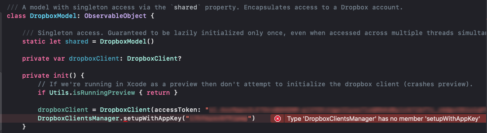

# Cross platform app (Dropbox MyFilesExplorer)

A demo Dropbox API app created with Xcode 12 and SwiftUI that runs on iOS and macOS clients.

# Contents

- [What you'll learn](#What-you'll-learn)
- [Getting started](#Getting-started)
- [Creatingan app on Dropbox](#Creating-an-app-on-Dropbox)
- [Installing the Dropbox SDK](#Installing-the-Dropbox-SDK)
- [Quick test of the Dropbox API](#Quick-test-of-the-Dropbox-API)
- [Data Model](#Data-Model)
- [Displaying Dropbox data in List](#Displaying-Dropbox-data-in-List)
- [Refactoring](#Refactoring)
- [Distinguishing between Files and Folders](#Distinguishing-between-Files-and-Folders)
- [Handling navigation to Files](#Handling-navigation-to-Files)
- [Cross-platform support](#Cross-platform-support)

# What you'll learn

If you follow along in the creation of this app you'll learn:

- The basics of the **Dropbox API** and **SwiftyDropbox** framework
- How to simply and naturally structure your app using the **MVVM** pattern
- Requesting data using the Dropbox API and **handling asynchronous results** and errors
- Using **View Composition** to refactor complex views into smaller, testable units
- **Passing data** between views
- Using **@Observable** objects and **@Published** properties
- Creating a **cross-platform** app and **sharing code** between OS versions

# Getting started
In this demo we'll create a cross-platform app that uses the Dropbox API to retrieve a list of files and folders from your Dropbox account.

Start by creating a new **App** using the **Multiplatform** template:


Name the app "MyFilesExplorer":


# Creating an app on Dropbox
 
The first thing we need to do is register our app with Dropbox.
Login to to your Dropbox account and then start the process at https://www.dropbox.com/developers/apps.
If you don't have a Dropbox account you can sign up for free at https://www.dropbox.com.

Click **Create app** to get started:


 
- Select to create a **Scoped access** app
- Give the app **full access** to your Dropbox account
- Name the app "MyFilesExplorer"


 
After clicking **Create app** you will be presented with a property sheet.
- On the **Settings** tab copy the **App key** field and paste it temporarily into a file in your MyFilesExplorer project
- Generate a **temporary access** token by clicking the **Generate** button
- Copy and paste the generated token into the same file that contains the App key and App secret

The access token allows this demo app to access *your personal* Dropbox account without having the go through the normal **OAuth2** authentication process.

> In a commercial app you'd need to use the OAuth2 authentication flow to dynamically retrieve an OAuth access token from Dropbox for any user.
> 
> For an example of implementing an OAuth2 authentication flow in SwiftUI see https://github.com/russell-archer/MyGitHub.
> Refer to https://github.com/dropbox/SwiftyDropbox#configure-your-project for details on how to implement an OAuth authentication flow with SwiftyDropbox.


On the **Permissions** tab give the app the following permissions:

- `account_info.read`
- `files.metadata.read`

Now submit the changes.
For now, you can leave the contents of the **Branding** and **Analytics** tabs with default values.

# Installing the Dropbox SDK

Dropbox provides a Swift SDK that makes working with their API easier. 
All the necessary request and response processing is handled by the **SwiftyDropbox** SDK. 
The SDK itself uses the **Alamofire** package to handle networking.
 
Refs: 
- https://github.com/dropbox/SwiftyDropbox#get-started
- https://www.dropbox.com/developers/documentation/swift#overview

Add the Dropbox SDK to your Xcode project with **File > Swift Packages > Add Package Dependency**.
The URL of the package is https://github.com/dropbox/SwiftyDropbox.git:


Note that at this stage we're adding the package to our iOS target:


To add SwiftyDropbox for other targets (e.g. macOS) select the target and then in **General** settings add **SwiftyDropbox** in 
the **Frameworks, Libraries, and Embedded Content** section:


# Quick test of the Dropbox API

To prove to ourselves that everything's working let's try and return the list of content in the root of our Dropbox account.

Create a new Swift file named **DropboxModel.swift** in the **Shared** group and add the following code:

```swift
import Foundation
import SwiftyDropbox

struct DropboxModel {
    
    private var dropboxClient = DropboxClient(accessToken: "paste-your-generated-access-token-here")
    
    init() {
        DropboxClientsManager.setupWithAppKey("paste-your-app=key-here")
    }
    
    func listFolder() {
        dropboxClient.files.listFolder(path: "").response { response, error in
            
            guard error == nil else {
                print("Error: \(error!)")
                return
            }
            
            guard let result = response else {
                print("No data in response")
                return
            }
            
            for entry in result.entries {
                switch entry {
                    case let fileMetaData as Files.FileMetadata:
                        print("File: \(fileMetaData.name)")
                    case let folderMetaData as Files.FolderMetadata:
                        print("Folder: \(folderMetaData.name)")
                    default:
                        print("Unknown object")
                }
                
                print(entry)
            }
        }
    }
}
```

Now update the `ContentView.swift` file to call `DropboxModel.listFolder()` when then view appears:

```swift
import SwiftUI

struct ContentView: View {
    
    let dropboxModel = DropboxModel()
    
    var body: some View {
        Text("Hello, world!")
            .padding()
            
            .onAppear() {
                dropboxModel.listFolder()
            }
    }
}
```

Run the app in the simulator. You should see output similar to the following:

```bash
Folder: Backups
{
    id = "id:xxxxx";
    name = Backups;
    "path_display" = "/Backups";
    "path_lower" = "/backups";
}
Folder: Notes
{
    id = "id:xxxxx";
    name = Notes;
    "path_display" = "/Notes";
    "path_lower" = "/notes";
}
Folder: Documents
{
    id = "id:xxxxx";
    name = Documents;
    "path_display" = "/Documents";
    "path_lower" = "/documents";
}
Folder: Camera Uploads
{
    id = "id:xxxxx";
    name = "Camera Uploads";
    "path_display" = "/Camera Uploads";
    "path_lower" = "/camera uploads";
}
```

At some point you may encounter the following error:

```bash
Error: API auth error - {
    ".tag" = "expired_access_token";
}
```

If so, goto to your Dropbox app console by clicking the **App console** button on the https://www.dropbox.com/developers page.
Generated access tokens have a limited lifetime for security reasons. Renew your access token by clicking **Generate**:


Copy and paste the token into `DropboxModel` where you're initializing the `DropboxClient`.

Try changing the path passed to `dropboxClient.files.listFolder(path:)` to a folder that contains files. For example, here's an extract from my Camera Uploads folder:

```bash
File: 2021-05-10 17.55.24.jpg
{
    "client_modified" = "2021-05-10T16:55:24Z";
    "content_hash" = xxxxx;
    id = "id:xxxxx";
    "is_downloadable" = 1;
    name = "2021-05-10 17.55.24.jpg";
    "path_display" = "/Camera Uploads/2021-05-10 17.55.24.jpg";
    "path_lower" = "/camera uploads/2021-05-10 17.55.24.jpg";
    rev = xxxxx;
    "server_modified" = "2021-05-17T10:54:21Z";
    size = 7530204;
}
File: 2021-05-10 17.55.24-1.jpg
{
    "client_modified" = "2021-05-10T16:55:24Z";
    "content_hash" = xxxxx;
    id = "id:xxxxx";
    "is_downloadable" = 1;
    name = "2021-05-10 17.55.24-1.jpg";
    "path_display" = "/Camera Uploads/2021-05-10 17.55.24-1.jpg";
    "path_lower" = "/camera uploads/2021-05-10 17.55.24-1.jpg";
    rev = xxxxx;
    "server_modified" = "2021-05-17T10:54:30Z";
    size = 7701136;
}
```

# Data Model
 
We've proven that we can authenticate with the Dropbox API using a pre-generated access token and successfully return data from our account.
We can now create a model that will hold file and folder data:

```swift
import Foundation
import SwiftyDropbox

struct DropboxItem {
    
    let id: String
    let name: String
    let path: String
    let size: UInt64
    let isFile: Bool
    
    init(id: String, name: String, path: String?, size: UInt64, isFile: Bool) {
        self.id = id
        self.name = name
        self.path = path ?? ""
        self.size = size
        self.isFile = true
    }
    
    init(fileMetaData: Files.FileMetadata) {
        self.init(id: fileMetaData.id, name: fileMetaData.name, path: fileMetaData.pathDisplay, size: fileMetaData.size, isFile: true)
    }
    
    init(folderMetaData: Files.FolderMetadata) {
        self.init(id: folderMetaData.id, name: folderMetaData.name, path: folderMetaData.pathDisplay, size: 0, isFile: false)
    }
}
```

Notice that we have three initializers, one to store file data, one to store folder data and a third that the file and folder initializers call.
We can update our `DropboxModel.listFolder()` method to store data returned by the Dropbox API:

```swift
func listFolder() {
    dropboxClient.files.listFolder(path: "").response { response, error in
        
        guard error == nil else {
            print("Error: \(error!)")
            return
        }
        
        guard let result = response else {
            print("No data in response")
            return
        }
        
        var folderData = [DropboxItem]()
        
        for entry in result.entries {
            switch entry {
                case let fileMetaData as Files.FileMetadata:
                    folderData.append(DropboxItem(fileMetaData: fileMetaData))
                case let folderMetaData as Files.FolderMetadata:
                    folderData.append(DropboxItem(folderMetaData: folderMetaData))
                default:
                    print("Unknown object")
            }
        }
        
        guard folderData.count > 0 else { return }
        folderData.forEach { item in
            print(item)
        }
    }
}
```

# Displaying Dropbox data in List

Now that we've got some basic data being returned from Dropbox we can display it in a `List` in `ContentView`.
Let's start by reworking our `DropboxModel.listFolder()` method to take a `path` parameter and a `completion` handler that we'll call when the data's ready:

```swift    
/// List the contents of the requested Dropbox path.
/// - Parameters:
///   - path: Path required. Must start with a forward slash (/).If an empty string ("") is passed the contents of the root folder is returned.
///   - completion: A completion handler that is called when the requested data is available or an error is encountered.
func listFolder(path: String, completion: @escaping (Result<[DropboxItem], DropboxModelError>) -> Void) {

    dropboxClient.files.listFolder(path: "").response { response, error in
        
        guard error == nil else {
            completion(.failure(.dropboxError))
            return
        }
        
        guard let result = response else {
            completion(.failure(.noData))
            return
        }
        
        var folderData = [DropboxItem]()
        
        for entry in result.entries {
            switch entry {
                case let fileMetaData as Files.FileMetadata: folderData.append(DropboxItem(fileMetaData: fileMetaData))
                case let folderMetaData as Files.FolderMetadata: folderData.append(DropboxItem(folderMetaData: folderMetaData))
                default: print("Unknown Dropbox object: \(entry)")
            }
        }
        
        guard folderData.count > 0 else {
            completion(.failure(.noEntries))
            return
        }
        
        completion(.success(folderData))
    }
}
```

The `DropboxModelError` enum referenced in the `Result` above looks like this:

```swift
enum DropboxModelError: Error {
    case noError, dropboxError, badPath, badAuthenticationCode, badResponse, noData, noEntries, cantGetToken, userNotAuthenticated
    
    func description() -> String {
        switch self {
            case .noError:                  return "No error."
            case .dropboxError:             return "Dropbox error. You may need to renew the access token."
            case .badPath:                  return "Invalid Dropbox path."
            case .badAuthenticationCode:    return "Dropbox supplied an invalid authentication code."
            case .badResponse:              return "Dropbox returned an invalid response."
            case .noData:                   return "Dropbox returned no data."
            case .noEntries:                return "Dropbox folder contains no entries."
            case .cantGetToken:             return "Request for Dropbox access token failed."
            case .userNotAuthenticated:     return "Dropbox user is not authenticated."
        }
    }
}
```

To make things easier to work with and keep a nice separation of concerns  between views and models, let's introduce a `ViewModel`.

> # The MVVM Pattern
> 
> If you've not encountered the **MVVM** (Model-View-ViewModel) pattern before here's a simple overview.
> 
> As programmers, experience teaches us that having large, complex objects that try to do lots of things (e.g. get data, share it and display it) will sooner or later cause problems. 
We should always strive to break large objects down into smaller, self-contained units that work together through well-defined interfaces.
> 
> A `ViewModel` acts as the glue that connects `Model` data to the `View` that presents it. In this way the view needs to know nothing about the actual format of the underlying data, and the model knows nothing about the UI.
> 
> In an SwiftUI app:
> 
> - The `View` defines the UI. Implements the `View` protocol
> - The `ViewModel` moves data between the `Model` and the `View` and responds to commands from the `View`. Implements the `ObservableObject` protocol
> - The `Model` encapsulates data and responds to requests from the `ViewModel`
> 
> The strict **separation-of-concerns** in MVVM means that ideally:
> 
> - The `View`
>     - **owns** and has knowledge of the `ViewModel`
>     - has no knowledge of the `Model`
>     
> - The `ViewModel`
>     - **owns** and has knowledge of the `Model`
>     - has no knowledge of the `View`
>     
> - The `Model`
>     - knows nothing about the `ViewModel` or `View`
> 
> 
> 

The view-model holds an instance of `DropboxModel` and provides a `getDropboxContent(for:)` method which can be called from `ContentView`.
When data is returned from `dropboxModel` we convert it to a simple string array that is published by the `folderContent` property:

```swift
/// A ViewModel that publishes data retrieved from DropboxModel.
class ViewModel: ObservableObject {
    
    /// The contents of the current Dropbox folder.
    @Published var folderContent = [String]()
    
    /// A model that encapsulates access to a Dropbox account's file system.
    let dropboxModel = DropboxModel()
    
    /// Get the contents of the requested Dropbox folder.
    /// - Parameter path: The required Dropbox path. Pass an empty string ("") to list the contents of the root folder.
    func getDropboxContent(for path: String) {
    
        dropboxModel.listFolder(path: path) { [unowned self] result in
            
            switch result {
                case .failure(let error): print(error)
                case .success(let data): folderContent = data.map { entry in entry.name }
            }
        }
    }
}
```

We can now update `ContentView` to use the new `ViewModel` and display the contents of the root Dropbox folder as follows:

```swift
struct ContentView: View {
    
    @StateObject var viewModel = ViewModel()
    
    var body: some View {
        List {
            ForEach(viewModel.folderContent, id: \.self) { entry in
                Text(entry)
                    .font(.title)
                    .padding()
            }
        }
        .onAppear() {
            viewModel.getDropboxContent(for: "")
        }
    }
}
```

When the view appears we call our view-model's `getDropboxContent(for:)` method. 
When the Dropbox data is available it's published by the view-model, which will cause our view to be re-rendered.

Running the app allows us to browse the root of our Dropbox account:


With some small changes we'll be able to reuse `ContentView` to display any folder.

# Refactoring

Now we have the basics of the app working, let's refactor `ContentView` and tidy things up a bit. 

First, create the following groups inside `Shared`: `Model`, `Util`, `ViewModel`, `View`:


Now move files into their relevant groups.

Refactor `ContentView` by creating four new sub-views: `ContentViewBody`, `FolderEntriesView`, `GettingDataView` and  `ErrorView`.
We can now extract `ContentView` content into separate views. This is known as **View Composition**. 

`ContentView` now looks like this:


```swift
struct ContentView: View {
    
    @StateObject var viewModel = ViewModel()
    var path = ""
    var isRoot: Bool { path == "" }

    var body: some View {
        
        if isRoot {
            
            NavigationView {
                ContentViewBody(viewModel: viewModel, path: path)
            }
            .navigationViewStyle(StackNavigationViewStyle())
            
        } else {
            
            ContentViewBody(viewModel: viewModel, path: path)
        }
    }
}
```

A new instance of `ContentView` (and it's associated `ViewModel`) will be created for each folder we browse.
The body of the view is essentially the same for all folders, except that if an instance of `ContentView` represents the root folder we wrap the contents in a `NavigationView`.

`ContentViewBody`, `FolderEntriesView`, `GettingDataView` and  `ErrorView` are defined as follows:

```swift
struct ContentViewBody: View {
    
    @ObservedObject var viewModel = ViewModel()
    
    var path = ""
    var isRoot: Bool { path == "" }
    private var navTitle: String { viewModel.hasContent ? (viewModel.path ?? "/ (root)") : "Loading..." }
    
    var body: some View {
        VStack {
            if viewModel.hasContent {
                
                FolderEntriesView(viewModel: viewModel)
                
            } else if viewModel.gettingData {

                GettingDataView()
                
            } else if viewModel.hasError {
                
                ErrorView(viewModel: viewModel)
            }
        }
        .navigationTitle(navTitle)
        .navigationBarTitleDisplayMode(isRoot ? .large : .inline)
        .onAppear() {
            if viewModel.path == nil { viewModel.path = path }
            try? viewModel.getDropboxContent()
        }
    }
}
```

```swift
struct FolderEntriesView: View {
    
    @ObservedObject var viewModel: ViewModel
    
    var body: some View {
        
        if viewModel.path == nil {
            EmptyView()
        } else {
            List {
                ForEach(viewModel.folderContent, id: \.self) { entry in
                    NavigationLink(destination: ContentView(path: "\(viewModel.path!)/\(entry)")) {
                        Text(entry)
                            .font(.title)
                            .padding()
                    }
                }
            }
        }
    }
}
```

```swift
struct GettingDataView: View {
    var body: some View {
        VStack {
            ProgressView()
            
            Image(systemName: "externaldrive.connected.to.line.below")
                .resizable()
                .frame(width: 50, height: 50)
                .padding()
                .foregroundColor(.blue)
        }
    }
}
```

```swift
struct ErrorView: View {
    
    @ObservedObject var viewModel: ViewModel
    
    var body: some View {
        VStack {
            Text(viewModel.errorCondition.description())
                .font(.title)
                .padding()
            
            Image(systemName: "xmark.octagon")
                .resizable()
                .frame(width: 50, height: 50)
                .padding()
                .foregroundColor(.red)
        }
    }
}
```

We can refactor `ViewModel` slightly to include some additional `@Published` properties (`gettingData` and `hasError`):

```swift
class ViewModel: ObservableObject {
    
    @Published var folderContent = [String]()           /// The contents of the current Dropbox folder.
    @Published var gettingData = false                  /// True if we're getting data from Dropbox
    @Published var hasError = false                     /// True if we have an error condition
    
    var hasContent: Bool { folderContent.count > 0 }    /// True if we have Dropbox content, false otherwise.
    var path: String?                                   /// The Dropbox path for our view. Should be set by the View. Will be "" for the root folder
    var errorCondition: DropboxModelError = .noError    /// The last error we encountered
    
    /// Get the contents of the Dropbox folder indicated by the `path` property. Throws DropboxModelError.badPath if `path` is nil.
    func getDropboxContent() throws {
        
        if path == nil { throw DropboxModelError.badPath }
        
        gettingData = true
        
        DropboxModel.shared.listFolder(path: path!) { [unowned self] result in
            
            gettingData = false
            
            switch result {
                case .failure(let error):
                    errorCondition = error
                    hasError = true
                    
                case .success(let data):
                    errorCondition = .noError
                    hasError = false
                    folderContent = data.map { entry in entry.name }
            }
        }
    }
}
```

We can also make a few updates to our `Model`. 
Most notably, because we want to share the model between multiple instances of `ViewModel`, we'll make it a `Singleton` that's accessed via the `shared` property.
Note how we enforce the singleton behavior by making the `initializer` private:

```swift
import Foundation
import SwiftyDropbox

/// A model with singleton access via the `shared` property. Encapsulates access to a Dropbox account.
class DropboxModel: ObservableObject {
        
    /// Singleton access. Guaranteed to be lazily initialized only once, even when accessed across multiple threads simultaneously.
    static let shared = DropboxModel()
    
    private var dropboxClient: DropboxClient?
    
    private init() {
        // If we're running in Xcode as a preview then don't attempt to initialize the dropbox client (crashes preview).
        if Utils.isRunningPreview { return }
        
        dropboxClient = DropboxClient(accessToken: "access-token-goes-here")
        DropboxClientsManager.setupWithAppKey("appkey-goes-here")
    }
    
    /// List the contents of the requested Dropbox path.
    /// - Parameters:
    ///   - path: Path required. Must start with a forward slash (/).If an empty string ("") is passed the contents of the root folder is returned.
    ///   - completion: A completion handler that is called when the requested data is available or an error is encountered.
    func listFolder(path: String, completion: @escaping (Result<[DropboxItem], DropboxModelError>) -> Void) {
        
        guard let client = dropboxClient else { return }
        
        client.files.listFolder(path: path).response { response, error in

            guard error == nil else {
                completion(.failure(.dropboxError))
                return
            }

            guard let result = response else {
                completion(.failure(.noData))
                return
            }

            var folderData = [DropboxItem]()

            for entry in result.entries {
                switch entry {
                    case let fileMetaData as Files.FileMetadata: folderData.append(DropboxItem(fileMetaData: fileMetaData))
                    case let folderMetaData as Files.FolderMetadata: folderData.append(DropboxItem(folderMetaData: folderMetaData))
                    default: print("Unknown Dropbox object: \(entry)")
                }
            }

            guard folderData.count > 0 else {
                completion(.failure(.noEntries))
                return
            }

            completion(.success(folderData))
        }
    }
}

```

Running the app now allows us to navigate from the root of our Dropbox account down to any depth required, and then backup again.
At this point folders and files aren't distinguished, so the behavior for tapping on a file is undefined.


# Distinguishing between Files and Folders

We only need to make a few simple changes to add support for distinguishing between files and folders because we are already gathering the necessary data.
First, in `ViewModel` change the `folderContent` property to be an array of `DropboxItem`, rather than a plain array of `String`:

```swift
class ViewModel: ObservableObject {
    
    @Published var folderContent = [DropboxItem]()      /// The contents of the current Dropbox folder.
```

Also update the `getDropboxContent()` method to remove the unnecessary mapping of `[DropboxData]` to `[String]`:

```swift
:
DropboxModel.shared.listFolder(path: path!) { [unowned self] result in
    
    :
    switch result {
        :
            
        case .success(let data):
            errorCondition = .noError
            hasError = false
            folderContent = data  // Remove "data.map { entry in entry.name }" and just assign data, which is already a [DropboxItem] 
    }
}
```

Finally, update `FolderEntriesView` to include an image of a folder if the entry is a folder:

```swift
struct FolderEntriesView: View {
    
    @ObservedObject var viewModel: ViewModel
    
    var body: some View {
        
        if viewModel.path == nil {
            EmptyView()
        } else {
            List {
                ForEach(viewModel.folderContent, id: \.self) { entry in
                    NavigationLink(destination: ContentView(path: "\(viewModel.path!)/\(entry.name)")) {
                        HStack {
                            if !entry.isFile {
                                Image(systemName: "folder")
                                    .resizable()
                                    .frame(width: 40)
                                    .padding()
                                    .foregroundColor(.blue)
                            }
                            
                            Text(entry.name)
                                .font(.title)
                                .padding()
                        }
                    }
                }
            }
        }
    }
}
```

Running the app shows:


# Handling navigation to Files

The final piece of functionality is to support the selection of files.
Currently, when the user taps on a file our app tries to navigate to it as if were a folder.

We can create a `FileDetails.swift` view to handle the selection of files:

```swift
import SwiftUI

struct FileDetails: View {
    
    var fileDetails: DropboxItem
    
    var body: some View {
        Form {
            Text(fileDetails.name).font(.headline)
            Text(fileDetails.path).font(.headline)
            Text("\(String(fileDetails.size)) bytes").font(.headline)
        }
        .navigationTitle("File Details")
        .navigationBarTitleDisplayMode(.large)
    }
}

struct FileDetails_Previews: PreviewProvider {
    static var previews: some View {
        let details = DropboxItem(id: "10", name: "invoice3.docx", path: "/Documents/Invoices/invoice3.docx", size: 12, isFile: true)
        FileDetails(fileDetails: details)
    }
}

```

Now update `FolderEntriesView` to distinguish between navigation to a folder or a file:

```swift
struct FolderEntriesView: View {
    
    @ObservedObject var viewModel: ViewModel
    
    var body: some View {

        List {
            ForEach(viewModel.folderContent, id: \.self) { entry in
                if entry.isFile {
                    
                    NavigationLink(destination: FileDetails(fileDetails: entry)) {
                        
                        Text(entry.name)
                            .font(.title)
                            .padding()
                    }
                    
                } else {
                    
                    NavigationLink(destination: ContentView(path: "\(viewModel.path!)/\(entry.name)")) {
                        HStack {
                            Image(systemName: "folder")
                                .resizable()
                                .frame(width: 40)
                                .padding()
                                .foregroundColor(.blue)
                            
                            Text(entry.name)
                                .font(.title)
                                .padding()
                        }
                    }
                }
            }
        }
    }
}
```

Rebuild the app and run it. If you tap on a file you should see:


# Cross-platform support

So far we've been developing solely with iOS clients in mind. 
Now let's switch track and consider how we can support macOS.

Before starting to make macOS-specific changes, let's build and run the Mac client as-is and see how it looks.
First, change the run target from iOS to macOS, and have it run on "My Mac":


You'll find that building for macOS **fails** with a number of errors.

The first one to look at is in `DropboxModel`, where the compiler complains that `Type 'DropboxClientsManager' has no member 'setupWithAppKey'`:



If you review the documentation at https://github.com/dropbox/SwiftyDropbox#configure-your-project you'll see that we should use
`DropboxClientsManager.setupWithAppKeyDesktop("APPKEY")` when building for macOS.

So iOS and macOS need different API calls. Let's fix it with conditional compilation as follows:

```swift
private init() {
    // If we're running in Xcode as a preview then don't attempt to initialize the dropbox client (crashes preview).
    if Utils.isRunningPreview { return }
    
    dropboxClient = DropboxClient(accessToken: "your-access-token-here")
    
    #if os(iOS)
    DropboxClientsManager.setupWithAppKey("your-app-key-here")
    #elseif os(macOS)
    DropboxClientsManager.setupWithAppKeyDesktop("our-app-key-here")
    #endif
}
```

Onto the next error, which is in `ContentViewBody`:


This issue is that macOS doesn't support the concept of a navigation bar: it's an iOS-only thing.
So, obviously the thing to do is wrap the offending line inside a conditional compilation statement.
Sadly, it doesn't work:


The reason is that in SwiftUI the `#if` compiler directive has to enclose a complete `View`, and not just a modifier, like this:

```swift
struct ContentViewBody: View {
    
    :    
    var body: some View {
        #if os(iOS)
        VStack {
            :
        }
        #elseif os(macOS)
        VStack {
            :
        }
        #endif
    }
}
```

For now let's use this somewhat inelegant solution. We'll come back to this issue once we've got the app building for macOS without errors.

The final error is in `ContentView`:


Again, we're trying to use an iOS-only thing which has no equivalent in macOS. The fix is the same conditional compilation directive as before:

```swift
struct ContentView: View {
    
    @StateObject var viewModel = ViewModel()
    var path = ""
    var isRoot: Bool { path == "" }

    var body: some View {
        
        if isRoot {
            
            #if os(iOS)
            NavigationView {
                ContentViewBody(viewModel: viewModel, path: path)
            }
            .navigationViewStyle(StackNavigationViewStyle())
            #elseif os(macOS)
            NavigationView {
                ContentViewBody(viewModel: viewModel, path: path)
            }
            #endif
            
        } else {
            
            ContentViewBody(viewModel: viewModel, path: path)
        }
    }
}
```

You should now find that the app builds for macOS without any errors.
Running the app shows the following:


There's also a bunch of errors in the console:

```
BackgroundSession <xxx> connection to background transfer daemon invalidated
BackgroundSession <xxx> an error occurred on the xpc connection to setup the background session: 
:
[] nw_resolver_can_use_dns_xpc_block_invoke Sandbox does not allow access to com.apple.dnssd.service
dnssd_clientstub ConnectToServer: connect() failed path:/var/run/mDNSResponder Socket:7 Err:-1 Errno:1 Operation not permitted
:
```

It looks like our connection is failing. 
The phrase `Sandbox does not allow access to com.apple.dnssd.service` seems to indicate we need to configure something to allow connections!

When building SwiftUI macOS apps you need to explicitly allow networking connections.
Select the macOS target, then on the **Signing & Capabilities** tab check both the incoming and outgoing network connections:


Build and run the app again. You should see:


Success...sort of!

We're getting back data from Dropbox and successfully showing it in a list. 
The window's divided into two panes, with the list being shown in the left pane.
If you select a folder its contents are shown in the right pane:


However, trying to select something in the right pane doesn't work.

It turns out that, unlike iOS, macOS doesn't inherit the parent view's `NavigationView`. 
So, we can wrap every child view we navigate to in its own `NavigationView`, like this:

```swift
struct ContentView: View {
    
    :
    var body: some View {
        
        if isRoot {
            :
        } else {
            
            #if os(iOS)
            ContentViewBody(viewModel: viewModel, path: path)
            #elseif os(macOS)
            NavigationView {
                ContentViewBody(viewModel: viewModel, path: path)
            }
            #endif
        }
    }
}
```

Once we do this navigation works well. As we go deeper into the folder hierarchy we get an ever-expanding number of panes added:


See https://github.com/russell-archer/SwiftUI-SplitViewNavDemo for more information on handling SwiftUI navigation (including **sidebars**) on a variety of devices.
